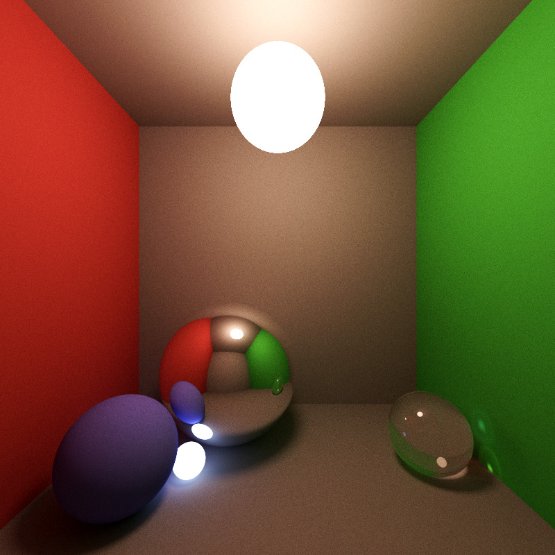

# light

Monte Carlo Ray Tacer based on Smallpaint by Károly Zsolnai-Fehér: https://users.cg.tuwien.ac.at/zsolnai/gfx/smallpaint/

## Build instructions

```bash
sudo apt install libboost-all-dev libopencv-dev libopenexr-dev
mkdir build
cd build
cmake ../ -G Ninja
ninja
./light --outfile image.png
```

For a full description of options: `./light --help`

## Example Output



[Viewing HDR output in a browser](examples/html/cornell.html)
