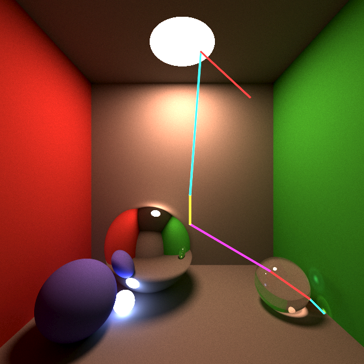

# light

A Simple MonteCarlo ray tracer based on Smallpaint by Károly Zsolnai-Fehér: https://users.cg.tuwien.ac.at/zsolnai/gfx/smallpaint/



### Points of Interest
* Basic non-recursive path tracer in C++.
* Uses OpenMP for multi-core rendering.
* Uses [xoshiro](http://prng.di.unimi.it) random number generator for sampling: faster than C++'s Mersenne Twister.
* Uses OpenCV for a basic preview window/GUI.

## Build and Usage Instructions

The following is only tested on Ubuntu 18.04:

```bash
sudo apt install libboost-all-dev libopencv-dev libopenexr-dev
mkdir build
cd build
cmake ../ -G Ninja
ninja
./light --outfile image.png
```

For a full description of options: `./light --help`

## Output Format

All image format support comes directly from OpenCV: the format is determined by the extension given to the `--outfile` option. In addition to the chosen output format light always saves the raw high dynamic range (HDR) output in an EXR file. You can use [pfs tools](http://pfstools.sourceforge.net) to manipulate and view the EXR file (e.g. to apply tone mapping: `pfsin image.png.exr | pfstmo_reinhard05 | pfsout tone_mapped.png`). The EXR file can also be used to resume rendering.

---
## Rendering the LuxBlend Reference Scene

There is a Blender scene file included that can be rendered with LuxRender for reference/comparison purposes.

Download the latest version of [LuxBlend](https://luxcorerender.org/download/) (no need to unzip).
In Blender 2.90.1 goto *Edit -> Preferences -> Add-ons -> Install* and select the zip file. It will warn about incompatibility with Blender 2.9 but it works fine.
Open *luxblend_reference/scene.blend* and press F12.